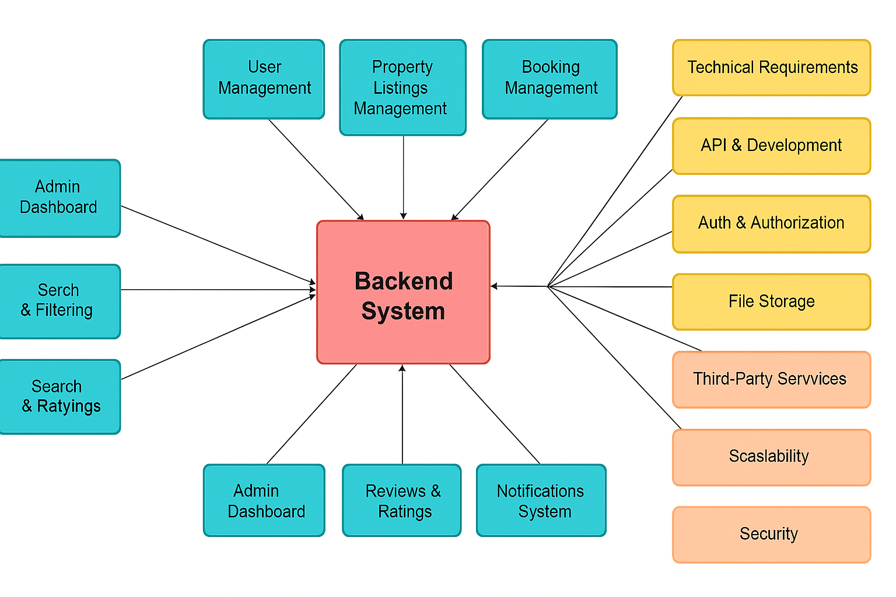

# 🏠 Airbnb Clone Backend — Features and Functionalities  

## 📘 Overview  
The **Airbnb Clone Backend** is designed to replicate the key functionalities of Airbnb, focusing on creating a **scalable**, **secure**, and **robust** system.  
This documentation provides a detailed breakdown of the backend features and functionalities that support user management, property listings, bookings, payments, and more.  

This is part of the **ALX Airbnb Project Documentation** phase, aimed at defining the backend logic and structure before implementation.  

---

## 🎯 Objective  
To identify and document the **core, technical, and non-functional requirements** that form the foundation of the Airbnb Clone backend.  
This serves as a reference blueprint for developers and ensures that every component aligns with real-world industry standards.  

---

## 🔑 Core Functionalities  

### 1️⃣ User Management  
- **User Registration:**  
  - Allow sign-up as **Guest** or **Host**.  
  - Secure authentication using **JWT (JSON Web Tokens)**.  
- **User Login & Authentication:**  
  - Login via email and password.  
  - Support **OAuth login** (Google, Facebook).  
- **Profile Management:**  
  - Update profile information such as name, photo, contact info, and preferences.  

---

### 2️⃣ Property Listings Management  
- **Add Listings:**  
  - Hosts create listings with title, description, location, price, amenities, and availability.  
- **Edit/Delete Listings:**  
  - Hosts can update or remove listings anytime.  

---

### 3️⃣ Search and Filtering  
- Search properties by:  
  - Location  
  - Price range  
  - Number of guests  
  - Amenities (Wi-Fi, pool, pet-friendly, etc.)  
- Implement **pagination** for large datasets.  

---

### 4️⃣ Booking Management  
- **Booking Creation:**  
  - Guests book properties for specified dates.  
  - Prevent double bookings using date validation.  
- **Booking Cancellation:**  
  - Guests and hosts can cancel under defined policies.  
- **Booking Status:**  
  - Track booking states: *Pending*, *Confirmed*, *Cancelled*, *Completed*.  

---

### 5️⃣ Payment Integration  
- Integrate secure gateways such as **Stripe** or **PayPal**.  
- Handle:  
  - Upfront guest payments.  
  - Automatic host payouts after completed bookings.  
- Support **multi-currency transactions**.  

---

### 6️⃣ Reviews and Ratings  
- Guests can rate and review properties.  
- Hosts can reply to reviews.  
- Link reviews directly to completed bookings to prevent spam or misuse.  

---

### 7️⃣ Notifications System  
- Send **email** and **in-app notifications** for:  
  - Booking confirmations  
  - Cancellations  
  - Payment updates  

---

### 8️⃣ Admin Dashboard  
- Admins can manage and monitor:  
  - Users  
  - Listings  
  - Bookings  
  - Payments  

---

## 🛠️ Technical Requirements  

### 1️⃣ Database Management  
- Use a **relational database** such as PostgreSQL or MySQL.  
- Required tables:  
  - `Users`  
  - `Properties`  
  - `Bookings`  
  - `Payments`  
  - `Reviews`  

---

### 2️⃣ API Development  
- Use **RESTful APIs** to expose backend functionalities.  
- Proper HTTP methods and responses:  
  - `GET` → Retrieve data  
  - `POST` → Create data  
  - `PUT/PATCH` → Update data  
  - `DELETE` → Remove data  
- Optionally, use **GraphQL** for complex queries.  

---

### 3️⃣ Authentication and Authorization  
- Use **JWT** for secure sessions.  
- Implement **Role-Based Access Control (RBAC):**  
  - Guests  
  - Hosts  
  - Admins  

---

### 4️⃣ File Storage  
- Store images (property photos, user profile pictures) using **file storage** or cloud options like AWS S3 / Cloudinary.  

---

### 5️⃣ Third-Party Services  
- Use **SendGrid** or **Mailgun** for email notifications.  

---

### 6️⃣ Error Handling and Logging  
- Implement **global error handling** for API responses.  
- Include **request logging** for debugging and analytics.  

---

## 🚀 Non-Functional Requirements  

### 1️⃣ Scalability  
- Modular architecture to support horizontal scaling.  
- Load balancing for high-traffic environments.  

---

### 2️⃣ Security  
- Encrypt sensitive data (passwords, payment info).  
- Use firewalls and rate limiting to mitigate attacks.  

---

### 3️⃣ Performance Optimization  
- Use **Redis caching** for frequent queries (e.g., search).  
- Optimize database queries for efficiency.  

---

### 4️⃣ Testing  
- Implement **unit** and **integration tests** using frameworks like `pytest`.  
- Automate API testing to ensure reliability.  

---

## 🧩 Visual Representation  

Below is the diagram outlining the **features and relationships** within the backend system.  

  

*(Diagram created using Draw.io and exported as PNG)*  

---

---

## 📚 Learning Objectives  
By completing this documentation project, you will learn how to:  
- Translate project requirements into structured features and functionalities.  
- Model system interactions using **Use Case Diagrams**.  
- Write clear **User Stories** that guide development.  
- Map data movement using **Data Flow Diagrams (DFDs)**.  
- Create **Flowcharts** for system processes.  
- Define **API endpoints**, validation, and behavior.  
- Use diagramming tools like **Draw.io** for technical documentation.  

---

## ⚙️ Key Concepts  
- **Backend Architecture:** Routers, controllers, models, services.  
- **RESTful API Design:** Proper HTTP verbs and response codes.  
- **Data Modeling:** Efficient schema for Users, Properties, Bookings, etc.  
- **Authentication & Authorization:** JWT-based verification and access control.  
- **Payment Gateway Integration:** Using **Stripe** or **PayPal** securely.  
- **Documentation:** Clear and maintainable technical writing.  

---

## 🧰 Tools and Libraries  
- **Draw.io / Diagrams.net:** For creating professional diagrams.  
- **Git & GitHub:** For version control and collaboration.  
- **Markdown:** For structured documentation.  
- **Node.js & Express.js (Potential):** For backend API development.  
- **PostgreSQL / MongoDB (Potential):** For data management.  
- **bcrypt / jsonwebtoken:** For authentication.  
- **Stripe API SDK:** For payments.  

---

## 🌍 Real-World Use Case  
This documentation mirrors the early stages of real-world software development (SDLC).  
Before coding, teams produce:  
- **Product Requirement Docs (PRDs)**  
- **System Design Mockups (Use Case & DFDs)**  
- **Agile Backlogs (User Stories)**  
- **Technical Specs (API requirements)**  

These ensure alignment between stakeholders and developers while reducing design errors.  

---

## ✍️ Author  
**Azumah Winime Awinbugur**  
*ALX Backend Engineering – Airbnb Clone Project*  

## 🗂️ Repository Structure  
