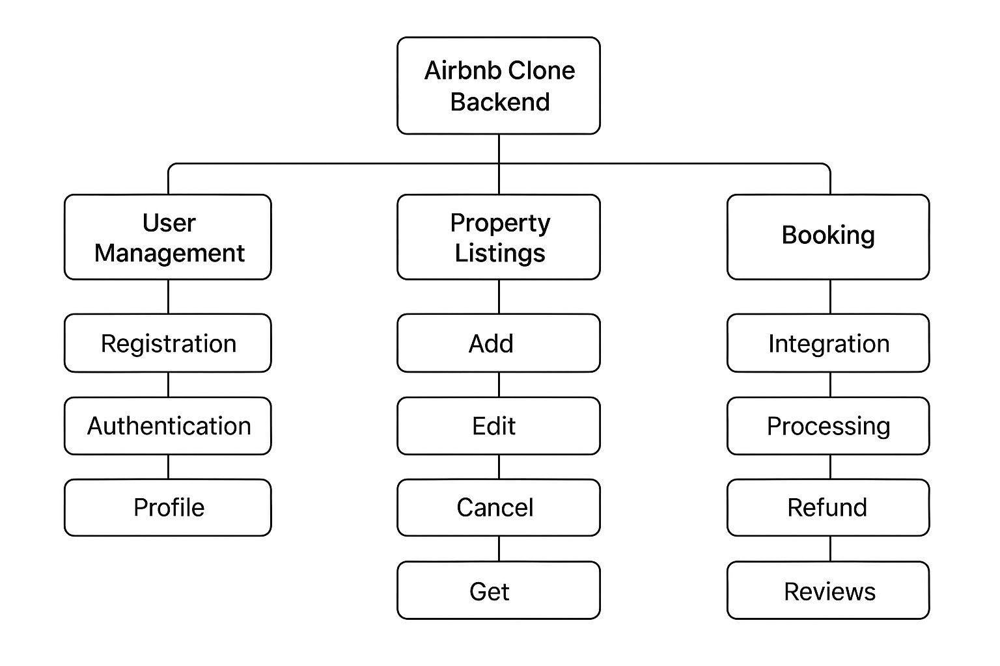
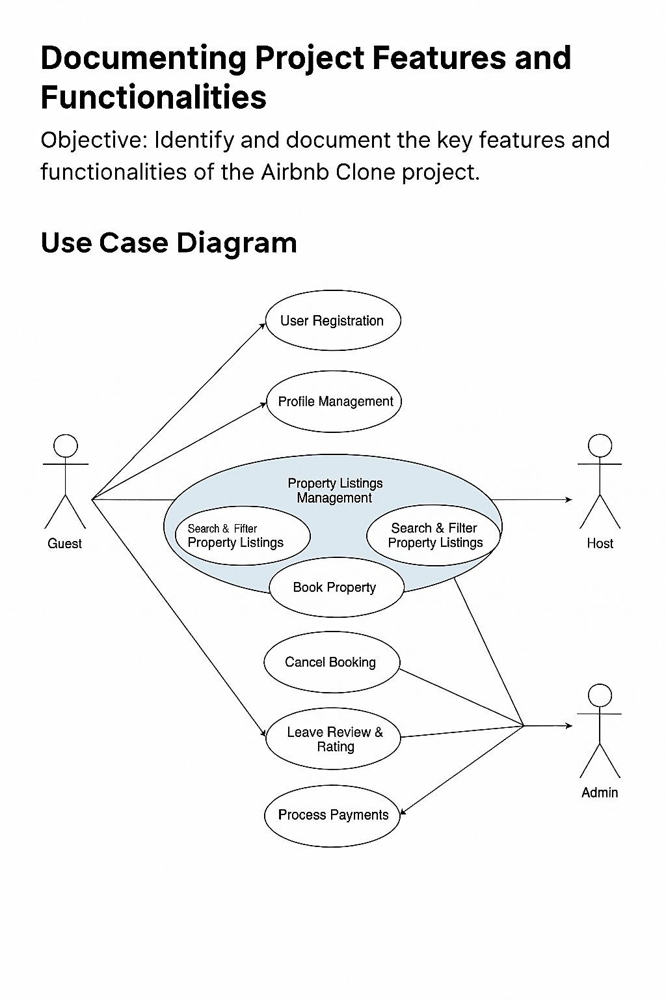

# Airbnb Clone Backend — Use Case Diagram

## Objective
Visualize system interactions using a **Use Case Diagram**. This diagram shows how different actors interact with the backend system, highlighting key functionalities such as user registration, property management, bookings, payments, and notifications.

## Actors
- **Guest**: Searches for properties, makes bookings, leaves reviews, receives notifications.
- **Host**: Adds/edits/deletes property listings, manages bookings, responds to reviews.
- **Admin**: Manages users, listings, bookings, and payments; monitors system activity.
- **Payment Gateway**: Handles secure payment transactions.
- **Email Service**: Sends notifications for bookings, cancellations, and payments.

## Use Cases / Functionalities
1. **User Management**
   - Register account (Guest / Host)
   - Login / Authentication
   - Update profile

2. **Property Listings**
   - Add new property
   - Edit / Delete property
   - View property listings

3. **Search & Filtering**
   - Search by location, price, guests, amenities
   - Pagination

4. **Booking Management**
   - Create booking
   - Cancel booking
   - Track booking status

5. **Payments**
   - Process guest payments
   - Automatic host payouts
   - Support multiple currencies

6. **Reviews & Ratings**
   - Leave reviews
   - Respond to reviews

7. **Notifications**
   - Email / in-app notifications for bookings, cancellations, payments

8. **Admin Dashboard**
   - Monitor users, listings, bookings, payments
   - Manage system operations

## Instructions for Diagram Creation
1. Open **Draw.io / Diagrams.net**.
2. Create a new **Use Case Diagram**.
3. Add **actors**: Guest, Host, Admin, Payment Gateway, Email Service.
4. Add **use cases** (ovals) for all functionalities listed above.
5. Connect actors to relevant use cases:
   - Guests → User Management, Booking, Payments, Reviews, Notifications
   - Hosts → Property Listings, Booking Management, Reviews, Notifications
   - Admin → Admin Dashboard, User/Booking/Payment Management
   - Payment Gateway → Payments
   - Email Service → Notifications
6. Export diagram as **PNG**.
7. Save PNG in `use-case-diagram/` directory of your GitHub repository.



Alternatively:

# 📊 Use Case Diagram — Airbnb Clone Backend

## 🎯 Objective  
Visualize system interactions using a **Use Case Diagram** to capture how different users (actors) interact with the Airbnb Clone backend system.

---

## 🧾 Description  
This diagram illustrates the **key functionalities** and **user interactions** within the backend system. It identifies the main actors — **Guest**, **Host**, and **Admin** — and maps their interactions with use cases such as:

- User Registration  
- Profile Management  
- Property Listings Management  
- Search & Filter Property Listings  
- Book Property  
- Cancel Booking  
- Leave Review & Rating  
- Process Payments  

---

## 👥 Actors  
- **Guest**: Can register, search listings, book properties, make payments, and leave reviews.  
- **Host**: Can manage property listings, respond to reviews, and handle booking cancellations.  
- **Admin**: Monitors users, listings, and payments.

---

## 📌 Use Cases  
| Actor  | Use Cases |
|--------|-----------|
| Guest  | Register, Login, Search Listings, Book Property, Cancel Booking, Make Payment, Leave Review |
| Host   | Register, Login, Add/Edit/Delete Listings, Cancel Booking, Respond to Reviews |
| Admin  | Monitor Users, Listings, Bookings, Payments |

---

## 🖼️ Diagram  


---

## 📁 File Info  
- **Repository**: `alx-airbnb-project-documentation`  
- **Directory**: `use-case-diagram/`  
- **File**: `README.md`  
- **Diagram**: `use-case-diagram.png` (exported from Draw.io)

---

## ✅ Next Steps  
- Ensure the diagram reflects all core functionalities.  
- Commit and push both `README.md` and `use-case-diagram.png` to GitHub.

```bash
git add use-case-diagram/README.md use-case-diagram/use-case-diagram.png
git commit -m "Add Use Case Diagram for Airbnb Clone Backend"
git push origin main

## Repository Structure
